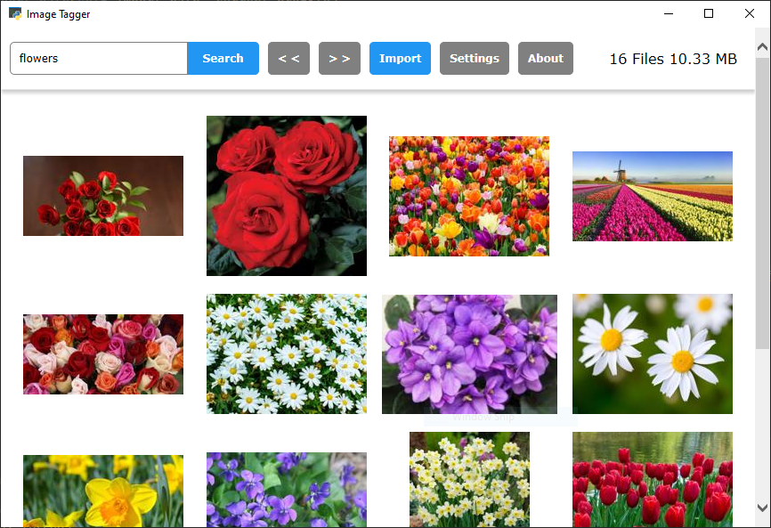
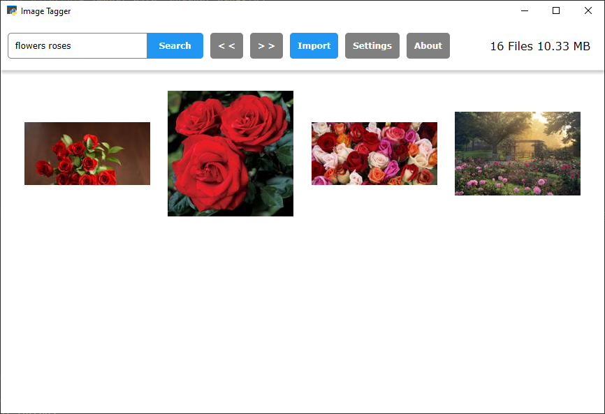
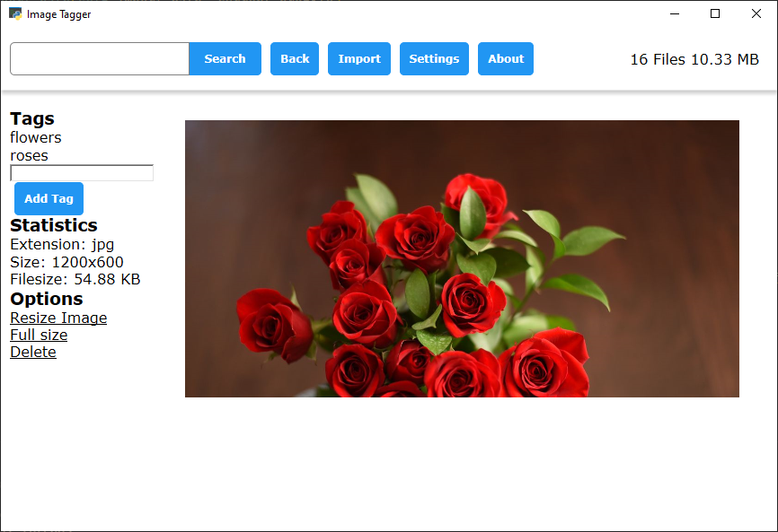

# ImageTagger
Yet another image tagging and viewing app - inspired by other image viewer apps and the tagging system of imageboards.

## Features

### Gallery View and Search

### Tag Search

### Image View

## Long-term Feature Goals
* Tag/album export
* More robust search
* User profiles/albums
* Tag categories

## Acknowledgements
* Pywebview - [Github](https://github.com/r0x0r/pywebview); [Website](https://pywebview.flowrl.com/)

#### Icons
* [Uri Herrera and others, KDE Visual Design Group; - KDE github; LGPL](https://commons.wikimedia.org/w/index.php?curid=49041173)
* [Andreas Kainz & Uri Herrera & Andrew Lake & Marco Martin & Harald Sitter & Jonathan Riddell & Ken Vermette & Aleix Pol & David Faure & Albert Vaca & Luca Beltrame & Gleb Popov & Nuno Pinheiro & Alex Richardson & Jan Grulich & Bernhard Landauer & Heiko Becker & Volker Krause & David Rosca & Phil Schaf / KDE, LGPL](https://commons.wikimedia.org/w/index.php?curid=49040296)